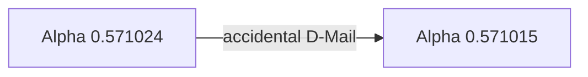

# Episode 01: Turning Point

*Prologue of the Beginning and the End* — the series premiere. A lecture on
time travel, a rooftop satellite, and a pool of blood on the eighth floor of
[[radio-kaikan|the Radio Kaikan building]]. Everything that follows begins here.

:::::columns{ratio="65-35"}
::::column

## Synopsis

[[okabe|Rintaro Okabe]] — self-styled mad scientist ==Hououin Kyouma== — drags
[[mayuri|Mayuri Shiina]] to Dr. Nakabachi's press conference on time machine
theory at the [[radio-kaikan|Radio Kaikan]]. Okabe interrupts the lecture to
accuse [[nakabachi|Dr. Nakabachi]] of plagiarizing [[wp:John Titor|John Titor]],
and is pulled out of the hall by a red-haired girl he has never met — who
insists he tried to tell her something *fifteen minutes ago*.

Minutes later, Okabe finds the same girl, [[kurisu|Kurisu Makise]], collapsed
in a pool of blood in an upstairs corridor. Shaken, he texts [[daru|Daru]] from
the street outside — and the world *lurches*. The crowds vanish. Radio Kaikan
now has a crashed satellite embedded in its roof, and according to everyone
else, it has been there since the morning.

:::note
This is the first on-screen worldline shift of the series. Okabe's ability to
retain memories across shifts is later named ==Reading Steiner== — see
[[alpha-worldline#Reading Steiner|the Alpha worldline article]].
:::

Back at the [[future-gadget-lab|Future Gadget Laboratory]], nobody remembers
the press conference — it was cancelled a week ago. Okabe's phone shows the
message to Daru was sent *a week before he wrote it*. And at a later lecture,
Kurisu Makise walks up to him: alive, unstabbed, and very annoyed.

::::

::::column

:::infobox{title="Turning Point" image="https://picsum.photos/seed/sg-ep01/300/180" caption="The satellite in the roof of Radio Kaikan."}
| | |
|---|---|
| Episode | 01 |
| Japanese title | 始まりと終わりのプロローグ |
| Air date | 2010-04-06 |
| Arc | [[episode-guide#The D-Mail arc\|D-Mail arc]] |
| Worldline | [[alpha-worldline\|Alpha]] $0.571024$ |
| Shift to | [[alpha-worldline\|Alpha]] $0.571015$ |
| Setting | [[akihabara\|Akihabara]] |
| Focus | [[okabe\|Okabe]], [[kurisu\|Kurisu]] |
| Gadget debut | [[phone-microwave\|Phone Microwave]] |
| Previous | — |
| Next | [[episode-02\|Time Travel Paranoia]] |
:::

::::

:::::

::section[Key events]{icon="⚡"}

| Time | Event | Worldline reading |
|---|---|---|
| 12:00 | Nakabachi conference begins | 0.571024 |
| 12:30 | Okabe confronted by Kurisu | 0.571024 |
| 12:45 | Kurisu found stabbed, 8F corridor | 0.571024 |
| 12:55 | Okabe texts Daru — first accidental D-Mail | 0.571024 |
| 12:55 | Worldline shift | 0.571015 |
| 18:00 | Satellite reported "since morning" | 0.571015 |

:::tip
The table above is sortable — click a header. The divergence column shows why
this episode is the series' ==turning point==: the shift is tiny
($\Delta d = 0.000009$) but it is the first one Okabe consciously survives.
:::

::section[The first D-Mail]{icon="📱"}

The text Okabe sends from outside Radio Kaikan reads, in full:

> Something you should know. Makise Kurisu has been stabbed. I found her body
> on the 8th floor.

Because the [[phone-microwave|Phone Microwave (name subject to change)]] was
running at the moment of transmission, the message arrived on Daru's phone
**a week in the past** — the lab's first D-Mail, sent before anyone knew
D-Mail was possible.[^1] SERN's involvement is not yet visible, but the
IBN 5100 that will dominate the mid-season is already sitting, forgotten, in
the storeroom of the [[yanabayashi-shrine|Yanabayashi Shrine]].

::section[Continuity]{icon="🔗"}

- First appearance of [[okabe]], [[mayuri]], [[daru]], [[kurisu]], and
  [[nakabachi|Dr. Nakabachi]].
- First appearance of the [[future-gadget-lab|Future Gadget Lab]] and FG
  gadget No. 8, the [[phone-microwave|Phone Microwave]].
- The metal Upa Mayuri finds at the conference becomes decisive in
  [[episode-22|the finale arc]] — a classic [[wp:Chekhov's gun|Chekhov's gun]].
- Okabe's catchphrase [[el-psy-kongroo]] is spoken four times.

:::collapse{title="Spoilers — what actually happened on the 8th floor"}
The stabbing Okabe witnesses is the event the entire series orbits. The blood
belongs to Kurisu, the assailant is revealed only in the final episodes, and
the "satellite" is Suzuha's time machine. The shift from $0.571024$ to
$0.571015$ happens because Okabe's text — relayed by SERN's echelon logging —
changed which worldline the [[alpha-worldline|Alpha attractor field]]
converged on. See [[steins-gate-worldline#Deceiving the past|Deceiving the past]].
:::

::section[Gallery]{icon="🖼️"}

:::gallery

:::

::section[Trivia]{icon="✨"}

- The episode's cold open plays out of chronological order; on first viewing
  the significance of the rooftop object is invisible.[^2]
- Production drafts titled this episode simply "Prologue".
- The @channel threads Okabe reads reference John Titor's posts —
  in this worldline, Titor posted in **2000**, a fact that quietly changes in
  [[episode-02|the next episode]].

[^1]: The lab does not coin the term "D-Mail" until [[episode-03]]. Mayuri
      suggests "DeLorean mail"; the abbreviation sticks.
[^2]: The staff commentary calls the satellite "the series' biggest lie told
      in plain sight."

#lore #episode

::navbox{title="Episodes" of="Episodes"}

[[Category:Episodes]]
