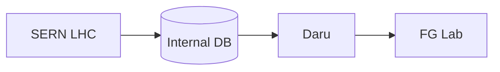

# Episode 03: Parallel World Paranoia

The episode where the [[future-gadget-lab|Future Gadget Lab]] stops being a
hobby club. A message to the past gets a name, a hack gets an audience, and
SERN gets a reason to notice four amateurs in [[akihabara|Akihabara]].

:::::columns{ratio="65-35"}
::::column

## Synopsis

Okabe invites [[kurisu|Kurisu]] to the lab to witness the
[[phone-microwave|Phone Microwave]] fire a message into the past. She arrives
prepared to debunk; she leaves having watched a text she wrote appear on a
phone **five days before she wrote it**. Her scientific integrity does the
rest — she cannot walk away from a working time machine, however stupid its
inventors.

[[mayuri|Mayuri]] christens the messages ==D-Mail== (from "DeLorean mail"),
and the lab formalizes its procedure: short messages, timestamped, logged.[^1]

Kurisu identifies the microwave's mechanism as a miniature
[[wp:Kerr black hole|Kerr black hole]] analogue — which should be impossible
at household wattage, unless someone else's experiment is leaking. That
someone is SERN, whose LHC has appeared in every anomalous reading Daru can
find. So [[daru|Daru]] does the obvious thing and hacks SERN.

:::danger
What they find in SERN's internal database — reports titled
[[jellyman-report|"Jellyman's Report"]] — are records of *human* temporal
transfer experiments. Every subject arrived as gel. Every subject was
listed as "material for disposal."
:::

::::

::::column

:::infobox{title="Parallel World Paranoia" image="https://picsum.photos/seed/sg-ep03/300/180" caption="Kurisu watches the impossible reproduce itself."}
| | |
|---|---|
| Episode | 03 |
| Japanese title | 並列過程のパラノイア |
| Air date | 2010-04-20 |
| Arc | [[episode-guide#The D-Mail arc\|D-Mail arc]] |
| Worldline | [[alpha-worldline\|Alpha]] $0.571015$ |
| Setting | [[future-gadget-lab\|Lab, Akihabara]] |
| Focus | [[kurisu\|Kurisu]], [[daru\|Daru]] |
| Named tech | D-Mail |
| Antagonist | SERN (first contact) |
| Previous | [[episode-02\|Time Travel Paranoia]] |
| Next | [[episode-04\|Interpreter Rendezvous]] |
:::

::::

:::::

::section[The D-Mail protocol]{icon="📱"}

The rules the lab writes down this episode remain canon for the whole series:

| Rule | Constraint | Discovered |
|---|---|---|
| 1 | 36 bytes maximum per D-Mail | [[episode-03]] |
| 2 | Longer messages split and arrive out of order | [[episode-03]] |
| 3 | Receiver's past self reads it as a normal text | [[episode-01]] |
| 4 | Worldline may shift; only Okabe remembers | [[episode-01]] |
| 5 | Microwave must be in operation at send time | [[episode-02]] |

:::tip
36 bytes is 18 full-width Japanese characters — the writers derived every
D-Mail in the series under this budget. Fans check. See the sortable log in
[[episode-guide#D-Mail record|the episode guide]].
:::

::section[The SERN hack]{icon="💻"}

:::figure{align="left" width="260"}

:::

Daru's break-in succeeds because SERN's legacy systems predate modern
encryption — the same reason SERN needs an IBN 5100 to read its *own* oldest
archives. The episode is careful about cause and effect: the lab is not yet
being watched, but the hack writes the first line of the file SERN will
eventually open.

The stolen documents describe "human is dead, mismatch" — the phrase fans
use as shorthand for the gel-transfer failure state.[^2]

::section[Continuity]{icon="🔗"}

- Kurisu unofficially joins the lab; her badge (Lab Member 004) is issued
  in [[episode-04]].
- First mention of the [[jellyman-report|Jellyman's Report]] by name.
- The 36-byte limit constrains the plots of [[episode-06]], [[episode-08]],
  and [[episode-10]].
- SERN's LHC experiments connect to Titor's 2036 — compare
  [[alpha-worldline#SERN's dystopia|the Alpha worldline article]].

:::collapse{title="Spoilers — why the hack matters"}
SERN's Echelon-style dragnet logs the intrusion. In the
[[alpha-worldline|Alpha attractor field]] this log entry is the proximate
cause of the raid in [[episode-12]], Mayuri's death, and the lab's
destruction. One curious hack, one dead friend — the show's cruelest
cause-and-effect chain.
:::

::section[Quotes]{icon="💬"}

> "It's not paranoia if the world really did change." — Okabe, to no one

> "I'm staying. Not because I believe you. Because I *measured* it." — Kurisu

[^1]: Mayuri's other candidate names included "past mail" (rejected as
      boring) and "OkaMail" (rejected with prejudice).
[^2]: The phrase appears verbatim in the stolen documents; the translation
      wobble is in-universe, from SERN's French-English internal reports.

#lore #episode

::navbox{title="Episodes" of="Episodes"}

[[Category:Episodes]]
