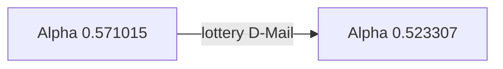

# Episode 06: Butterfly Effect's Divergence

The lab stops observing and starts experimenting. The first *deliberate*
D-Mail is sent, the first worldline shift is engineered on purpose — and
Okabe's lonely superpower finally gets a name.

:::::columns{ratio="65-35"}
::::column

## Synopsis

Against [[kurisu|Kurisu]]'s explicit objection ("we understand nothing about
the side effects"), the lab votes to run a controlled test: a D-Mail to
[[daru|Daru]]'s past phone containing a lottery number.[^1]

The send works. The world lurches. And Okabe, alone, remembers the
*previous* version of the evening — the number they chose, the argument, the
pizza. Everyone else remembers having sent a *different* message. The ticket
in Daru's wallet is real, and it is a **losing** ticket: the number arrived
garbled past the 36-byte boundary.

Kurisu names Okabe's cross-worldline memory ==Reading Steiner==, borrowing
the term from Okabe's own chuuni vocabulary, to his enormous satisfaction
and her immediate regret.

Meanwhile [[suzuha-amane|Suzuha Amane]], [[mr-braun|Mr. Braun]]'s new
part-timer, takes an instant, unexplained dislike to Kurisu — and an equally
unexplained interest in whether the lab has "sent anything" yet.

:::note
Suzuha's hostility is the episode's dangling thread. It is not resolved
until [[episode-11]], and the resolution recolors every scene she is in.
:::

::::

::::column

:::infobox{title="Butterfly Effect's Divergence" image="https://picsum.photos/seed/sg-ep06/300/180" caption="One losing lottery ticket, one proven mechanism."}
| | |
|---|---|
| Episode | 06 |
| Japanese title | 蝶翼のダイバージェンス |
| Air date | 2010-05-11 |
| Arc | [[episode-guide#The D-Mail arc\|D-Mail arc]] |
| Worldline | [[alpha-worldline\|Alpha]] $0.571015$ |
| Shift to | [[alpha-worldline\|Alpha]] $0.523307$ |
| D-Mail | Lottery number (garbled) |
| Named | Reading Steiner |
| Focus | [[okabe\|Okabe]], [[suzuha-amane\|Suzuha]] |
| Previous | [[episode-05\|Starmine Rendezvous]] |
| Next | [[episode-07\|Divergence Singularity]] |
:::

::::

:::::

::section[The experiment]{icon="🧪"}

| Parameter | Value |
|---|---|
| Message | Lottery number, week 19 draw |
| Payload size | 41 bytes — **over budget** |
| Bytes delivered intact | 36 |
| Target | Daru's phone, −72 hours |
| Divergence before | 0.571015 |
| Divergence after | 0.523307 |
| Who remembers the original line | Okabe only |

:::tip
Sortable-table exercise for new readers: sort the
[[episode-guide#D-Mail record|full D-Mail record]] by divergence delta and
this "harmless" test is the third-largest shift of the whole D-Mail arc.
Small causes, large worldlines — the [[wp:Butterfly effect|butterfly effect]]
of the title.
:::

::section[Reading Steiner]{icon="🧠"}

The episode gives the series its second pillar (after the D-Mail itself).
The rules, as established here and refined in [[episode-07]]:

- Okabe's memories persist across worldline shifts; his body does not move.
- Everyone else's memories are *rewritten to have always been consistent*
  with the new line.
- The transition is subjectively instant — a lurch, a flicker of vertigo.
- No other confirmed carrier exists on the
  [[alpha-worldline|Alpha attractor field]].[^2]

For the physics-flavored fan theories, see
[[worldlines|the worldline overview]] and
[[alpha-worldline#Reading Steiner|Alpha worldline: Reading Steiner]].

::section[Continuity]{icon="🔗"}

- First deliberate worldline shift; the D-Mail log begins its numbered
  entries here.
- Suzuha asks Okabe whether he is "the lab's founder, the one they talk
  about" — past tense, unnoticed by everyone including, on first viewing,
  the audience.
- The garbled-payload rule set up in [[episode-03]] pays off exactly as
  documented: rule 2, out-of-order arrival.
- Mayuri buys the metal Upa a companion — a [[upa|vinyl Upa]] — which
  matters enormously in [[episode-22]].

:::collapse{title="Spoilers — why Suzuha hates Kurisu"}
In Suzuha's 2036, Kurisu Makise is remembered as the scientist whose work
SERN built its time-travel monopoly on. Suzuha is meeting, in the flesh, the
person her war is named after — years before Kurisu does the work. The
tragedy is that both of them are right to trust the lab and right to fear
each other.
:::

::section[Gallery]{icon="🖼️"}

:::gallery

:::

[^1]: Daru's argument — "if we're going to break causality, we should at
      least profit" — wins 3–1. Kurisu registers her dissent in the log.
[^2]: The [[steins-gate-worldline|Steins Gate worldline]] finale implies at
      least one other partial carrier. The series leaves it deliberately
      unconfirmed.

#lore #episode

::navbox{title="Episodes" of="Episodes"}

[[Category:Episodes]]
