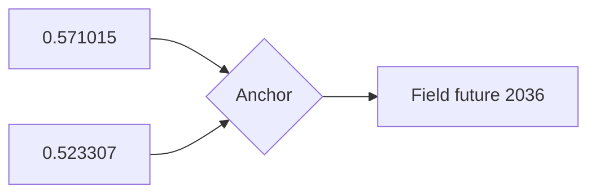

# Episode 07: Divergence Singularity

Everyone wants a D-Mail. The lab grows to six members, the send queue grows
a waiting list, and Okabe begins to notice that every wish granted moves an
invisible number he cannot yet read.

:::::columns{ratio="65-35"}
::::column

## Synopsis

Word of the "wish-granting mail" spreads inside the lab's small orbit.
[[faris-nyannyan|Faris]] and [[ruka-urushibara|Ruka]] each quietly ask Okabe
for a send of their own; [[moeka-kiryu|Moeka]] — now Lab Member 005 after a
membership drive Okabe conducts mostly by fiat — asks pointed questions
about the machine's *range*.[^1]

[[kurisu|Kurisu]] formalizes the experiment log and, in the episode's
centerpiece scene, works through the physics on the lab's whiteboard:
if [[wp:John Titor|Titor]]'s attractor-field model is right, the shifts the
lab causes are not branches but **convergences** — the river bends, then
rejoins. Big changes need not big causes but the right *singular points*.

Okabe, the only one who remembers all four worldlines the lab has now
occupied, starts writing his private ledger of differences: which shops
changed names, which posters changed art, who takes sugar now. The scene is
scored like horror, because it is: he is measuring his own drift from
everyone he knows.

:::warning
The lab still has no instrument. The number Okabe is groping for —
divergence — will not be readable until the
[[divergence-meter|Divergence Meter]] exists, and the person who builds it
hasn't suffered enough yet to build it.
:::

::::

::::column

:::infobox{title="Divergence Singularity" image="https://picsum.photos/seed/sg-ep07/300/180" caption="The whiteboard lecture: rivers, not branches."}
| | |
|---|---|
| Episode | 07 |
| Japanese title | 断層のダイバージェンス |
| Air date | 2010-05-18 |
| Arc | [[episode-guide#The D-Mail arc\|D-Mail arc]] |
| Worldline | [[alpha-worldline\|Alpha]] $0.523307$ |
| New member | 005 [[moeka-kiryu\|Moeka Kiryu]] |
| Key concept | Attractor field convergence |
| Focus | [[okabe\|Okabe]], [[kurisu\|Kurisu]] |
| Previous | [[episode-06\|Butterfly Effect's Divergence]] |
| Next | [[episode-08\|Chaos Theory Homeostasis I]] |
:::

::::

:::::

::section[The whiteboard model]{icon="📐"}

Kurisu's lecture, reproduced by fans from freeze-frames, sketches the
series' cosmology in four claims:

1. Worldlines within an attractor field differ in detail but converge on
   the same major events — $d$ values $0.000000 \le d < 1.000000$ all flow
   to the same 2036.
2. Crossing between fields requires shifting $d$ across an integer
   boundary — an event no D-Mail has yet achieved.
3. Certain events are ==convergence anchors==: they occur on every line of
   a field regardless of intervention.
4. An observer with cross-line memory (Reading Steiner) experiences
   convergence as fate. Everyone else experiences it as *nothing at all*.

For the full formalism see [[worldlines|Worldlines]] and the field pages:
[[alpha-worldline|Alpha]], [[beta-worldline|Beta]],
[[steins-gate-worldline|Steins Gate]].

::section[Membership drive]{icon="🪪"}

| No. | Member | Recruited by | Knows the truth? |
|---|---|---|---|
| 001 | [[okabe\|Okabe]] | — | All of it |
| 002 | [[mayuri\|Mayuri]] | — | Some |
| 003 | [[daru\|Daru]] | — | Most |
| 004 | [[kurisu\|Kurisu]] | [[episode-04\|Ep. 04]] | Most |
| 005 | [[moeka-kiryu\|Moeka]] | This episode | *See below* |

:::collapse{title="Spoilers — what Moeka knows"}
Everything. Her membership is a placement. The "range" question is her
handler's, verbatim, and her report this week is why SERN upgrades the lab
from *logged curiosity* to *active target*. The raid clock starts here.
:::

::section[Analysis]{icon="🔬"}

:::figure{align="left" width="260"}

:::

This is the season's quietest episode and its most structurally important.
Nothing explodes; a model is stated. But every later tragedy — Mayuri's
deaths in the [[alpha-worldline|Alpha field]], the war in the
[[beta-worldline|Beta field]] — is just claim 3 wearing a different face.
The fandom calls this episode "the rules card," and it is the page most
linked from [[worldlines|worldline articles]] on this wiki.[^2]

::section[Continuity]{icon="🔗"}

- Okabe's ledger becomes the seed data for the
  [[divergence-meter|Divergence Meter]]'s calibration in [[episode-13]].
- Faris's and Ruka's D-Mail requests are granted in [[episode-09]] and
  [[episode-10]] respectively — each a full episode of consequences.
- First appearance of the phrase "the universe has a beginning, but no end."

[^1]: Okabe's stated criteria for membership: enthusiasm, discretion, and
      tolerance for the phrase [[el-psy-kongroo]]. Applied inconsistently.
[^2]: Wiki trivia: this page is the most-inbound-linked episode page,
      beating [[episode-01]] by a nose.

#lore #episode

::navbox{title="Episodes" of="Episodes"}

[[Category:Episodes]]
