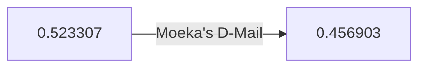

# Episode 08: Chaos Theory Homeostasis I

Moeka's D-Mail goes out, and the single most valuable object in the lab
quietly stops ever having arrived. The Homeostasis trilogy begins.

:::::columns{ratio="65-35"}
::::column

## Synopsis

[[moeka-kiryu|Moeka]] finally states her wish: a D-Mail to her own past
phone, about the IBN 5100. She frames it as closure — a message about a
lost opportunity to acquire the machine for her editor. The lab, softened
by weeks of granting smaller wishes, agrees.

Okabe operates the [[phone-microwave|Phone Microwave]]. The lurch comes.
And when Reading Steiner clears, Okabe is standing in a
[[future-gadget-lab|lab]] with **no IBN 5100 in it** — a lab where the
shrine storeroom was emptied *before* [[episode-05|the retrieval]], where
[[daru|Daru]]'s SERN decode never finished, and where nobody but Okabe has
ever seen the [[jellyman-report|Jellyman's Report]] in full.

Worse: the divergence reading (reconstructed later — see
[[divergence-meter]]) has moved *down*, to $0.456903$, deeper into the
[[alpha-worldline|Alpha attractor field]].

:::danger
The lab has lost its only means of finishing the SERN decode, and does not
know — cannot know — what Moeka's message actually said. Okabe alone
remembers there ever being something to lose.
:::

Moeka, for her part, reads her own old mail with an unreadable expression,
thanks Okabe politely, and does not come to the lab the next day. Or the
day after.

::::

::::column

:::infobox{title="Chaos Theory Homeostasis I" image="https://picsum.photos/seed/sg-ep08/300/180" caption="The empty corner where a computer used to have always been."}
| | |
|---|---|
| Episode | 08 |
| Japanese title | 夢幻のホメオスタシス |
| Air date | 2010-05-25 |
| Arc | [[episode-guide#The D-Mail arc\|D-Mail arc]] |
| Worldline | [[alpha-worldline\|Alpha]] $0.523307$ |
| Shift to | [[alpha-worldline\|Alpha]] $0.456903$ |
| D-Mail | Moeka's, re: IBN 5100 |
| Casualty | The IBN 5100 (retroactive) |
| Focus | [[moeka-kiryu\|Moeka]], [[okabe\|Okabe]] |
| Previous | [[episode-07\|Divergence Singularity]] |
| Next | [[episode-09\|Chaos Theory Homeostasis II]] |
:::

::::

:::::

::section[Shift record]{icon="📉"}

| Field | Before | After |
|---|---|---|
| Divergence | 0.523307 | 0.456903 |
| IBN 5100 location | FG Lab | Unknown / never retrieved |
| SERN decode | 60% complete | Never started |
| Moeka's lab visits | Daily | Ceased |
| Okabe's ledger pages | 31 | 47 |

:::note
The Homeostasis trilogy ([[episode-08|this episode]] through
[[episode-10]]) is structured as three wishes and three prices. The title's
"homeostasis" is the attractor field itself: the worldline *heals* around
every change, and what it heals over is people.
:::

::section[What was in the mail?]{icon="✉️"}

The episode withholds Moeka's message text — the only granted D-Mail whose
content the lab never logs. Fan reconstruction from later episodes:

:::::tabs
:::tab{label="What Okabe assumes"}
A sentimental note to her past self about a missed purchase. This is what
the log records, on Moeka's own description.
:::
:::tab{label="What it provably did"}
Moved the IBN 5100 out of the lab's causal reach *years* before the lab
wanted it — which requires the message to have contained an actionable
location, not a feeling. Compare
[[episode-04#The IBN 5100|the retrieval trail]].
:::
::::tab{label="Spoiler reading"}
:::warning
Sent to her own phone, read by her past self, forwarded to "FB" — a SERN
retrieval order with a years-long head start. The lab used its own machine
to arm its enemy. This is confirmed in [[episode-12]].
:::
::::
:::::

::section[Analysis]{icon="🔬"}

The episode's horror is administrative. Nothing on screen is violent; a
computer is simply absent, and a friendly member stops visiting. But the
audience — trained for seven episodes to price divergence moves — watches
$0.523 \to 0.456$ and understands the lab has been *spent down*, wish by
wish, toward whatever waits at the bottom of the
[[alpha-worldline#Divergence readings|Alpha field's floor]].[^1]

::section[Continuity]{icon="🔗"}

- The IBN 5100's retroactive loss makes [[episode-05]] a memory only Okabe
  holds — the series' first fully "orphaned" episode.
- Moeka's absence sets up her reappearance in [[episode-12]].
- Daru observes the microwave's power draw spiked during this send;
  Kurisu files the anomaly. It becomes the
  [[time-leap-machine|Time Leap Machine]]'s design seed in [[episode-11]].

:::collapse{title="Spoilers — the trilogy's shape"}
Three wishes: Moeka's (this episode), [[faris-nyannyan|Faris]]'s
([[episode-09]]), [[ruka-urushibara|Ruka]]'s ([[episode-10]]). Three prices:
the IBN, Akihabara itself, and a life story. Undoing all three, one by one,
is the entire back half of the season — the wish arc played in reverse as a
grief arc.
:::

[^1]: The reconstructed values on this wiki follow the
      [[divergence-meter|Divergence Meter]]'s retroactive calibration table;
      the meter itself does not exist on-screen until [[episode-13]].

#lore #episode

::navbox{title="Episodes" of="Episodes"}

[[Category:Episodes]]
