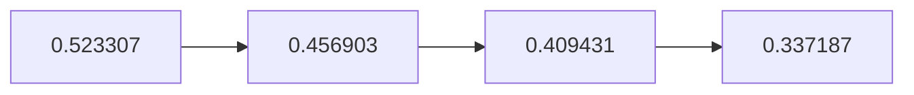

# Episode 10: Chaos Theory Homeostasis III

The last wish of the trilogy is granted, the divergence number falls to the
bottom of its arc, and Suzuha finally says what she came to say.

:::::columns{ratio="65-35"}
::::column

## Synopsis

[[ruka-urushibara|Ruka]]'s wish, carried since [[episode-07]], is the
trilogy's most personal: a D-Mail to Ruka's mother, seventeen years in the
past, about a diet superstition — one said to determine a baby's sex. Okabe
sends it expecting nothing. The lurch says otherwise.

In the new line — divergence $0.337187$, the lowest reading of the entire
[[alpha-worldline|Alpha arc]] — Ruka was born a girl. Nothing else visibly
changes: same shrine, same gentleness, same devotion to Okabe's ridiculous
mentorship. The episode spends its middle act on precisely this stillness,
letting the audience hunt the frame for differences and find only one.

Meanwhile [[suzuha-amane|Suzuha]] quits her job at [[mr-braun|Mr. Braun]]'s
shop, announces she is leaving to "find her father," and asks Okabe to
throw her a farewell party at the [[future-gadget-lab|lab]]. At the party
she almost tells him something — and then the episode's last scene hands
her a reason not to leave at all.[^1]

:::warning
$0.337187$ matters. It is the value fans call ==the floor== — the reading
at which the Alpha field's convergence anchor stops being avoidable by
local moves. See [[alpha-worldline#Divergence readings|the readings table]].
:::

::::

::::column

:::infobox{title="Chaos Theory Homeostasis III" image="https://picsum.photos/seed/sg-ep10/300/180" caption="The floor of the Alpha arc: 0.337187."}
| | |
|---|---|
| Episode | 10 |
| Japanese title | 相生のホメオスタシス |
| Air date | 2010-06-08 |
| Arc | [[episode-guide#The D-Mail arc\|D-Mail arc]] |
| Worldline | [[alpha-worldline\|Alpha]] $0.409431$ |
| Shift to | [[alpha-worldline\|Alpha]] $0.337187$ |
| D-Mail | Ruka's, −17 years |
| Farewell | [[suzuha-amane\|Suzuha]] (postponed) |
| Focus | [[ruka-urushibara\|Ruka]], [[suzuha-amane\|Suzuha]] |
| Previous | [[episode-09\|Chaos Theory Homeostasis II]] |
| Next | [[episode-11\|Dogma in Event Horizon]] |
:::

::::

:::::

::section[The trilogy, tallied]{icon="🧾"}

| Wish | Episode | Divergence after | Price paid by |
|---|---|---|---|
| Moeka's | [[episode-08\|08]] | 0.456903 | The lab (IBN 5100) |
| Faris's | [[episode-09\|09]] | 0.409431 | The city |
| Ruka's | [[episode-10\|10]] | 0.337187 | Nobody — *apparently* |

:::note
Sort the [[episode-guide#D-Mail record|master D-Mail table]] by the
divergence column and the trilogy forms a clean monotone descent — the
writers' arithmetic was planned to the sixth decimal before episode one
aired.
:::

::section[Suzuha's almost-confession]{icon="🚲"}

::::tabs
:::tab{label="What she says"}
That she came to Akihabara looking for her father, that the only clue she
has is a name and this district, and that the lab is the first place since
2036 — she catches herself — *since forever* that felt like one.
:::
:::tab{label="What she doesn't"}
Who she is, what the "satellite" on [[radio-kaikan|Radio Kaikan]] is, why
she flinched when the lab's microwave was mentioned, and what she knows
about [[kurisu|Kurisu]]. All four silences detonate in [[episode-11]].
:::
:::tab{label="The interrupted line"}
> "Okabe. If you ever get the chance to undo all of this—"

The party horn goes off. The series never lets her finish the sentence;
[[episode-11]] makes finishing it unnecessary.
:::
::::

::section[Analysis]{icon="🔬"}

The trilogy closes on its quietest change and its heaviest theme: a wish
that alters a person's entire life story *and changes the worldline less
than a lottery ticket did*. Attractor-field homeostasis is not justice —
it prices what the universe cares about, not what people do.[^2] Ruka's
line becomes the emotional pivot of the undo arc, where Okabe must ask for
each wish back, this one first, from people who have lost nothing they can
remember.

::section[Continuity]{icon="🔗"}

- Lowest divergence value of the series: $d=0.337187$.
- Suzuha's bicycle — a fixed-gear she maintains obsessively — is the same
  frame glimpsed in the [[episode-01]] cold open, one of the earliest
  planted clues.
- Moeka has not visited since [[episode-08]]; her phone, Daru notes, now
  pings a tower near the lab *nightly*.
- Ruka's shrine still has no IBN 5100 in this line — the trail stays cold
  until [[episode-11]] reframes the whole search.

:::collapse{title="Spoilers — why the party matters"}
The farewell party is the last unguarded evening of the season. From
[[episode-11]] onward every gathering is under surveillance, and by
[[episode-12]] the lab as the audience knows it is gone. The staff shot the
party scene last, after the finale, and it shows.
:::

[^1]: The reason is delivered by news broadcast in the episode's final
      thirty seconds; discussing it here would spoil [[episode-11]].
[^2]: Kurisu's phrasing, from the whiteboard scene in [[episode-07]]:
      "The field conserves its story, not our feelings."

#lore #episode

::navbox{title="Episodes" of="Episodes"}

[[Category:Episodes]]
