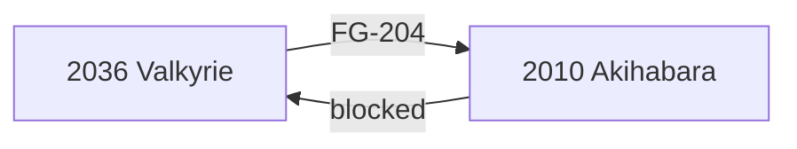

# Episode 11: Dogma in Event Horizon

Suzuha's identity, the satellite's true nature, and a lecture that turns
memory into cargo. The season's mask comes off in forty minutes of plot
delivered at terminal velocity.

:::::columns{ratio="65-35"}
::::column

## Synopsis

The news report that ended [[episode-10]] plays in full: the "satellite" on
[[radio-kaikan|Radio Kaikan]] has been identified by JAXA as *not matching
any launched object*. [[suzuha-amane|Suzuha]] hears it and goes white.

Cornered — gently — by Okabe, she tells the truth: she is a courier from
2036, the [[wp:John Titor|John Titor]] of the @channel posts, and the
object on the roof is her **time machine**, damaged on arrival in the
[[episode-01]] cold open. It travels to the past only. It cannot take her
home. Her mission — recover an IBN 5100, stop SERN's archive from ever
becoming readable *by SERN alone* — has been failing since the machine's
dome cracked.[^1]

Meanwhile [[kurisu|Kurisu]], following the power-draw anomaly filed in
[[episode-08]], presents to the lab the season's second machine: memory
data — roughly 3.24 terabytes per person, she estimates — could be
compressed and sent through the microwave's field **instead of text**. Not
a body. A mind. The [[time-leap-machine|Time Leap Machine]], on a
whiteboard, one week before the lab will need it more than anything.

:::danger
SERN's dragnet flags Kurisu's lecture the night it happens. The lab's
countdown, running silently since [[episode-03|the hack]], has fewer than
two episodes left on it.
:::

::::

::::column

:::infobox{title="Dogma in Event Horizon" image="https://picsum.photos/seed/sg-ep11/300/180" caption="The 'satellite', named at last."}
| | |
|---|---|
| Episode | 11 |
| Japanese title | 事象地平のドグマ |
| Air date | 2010-06-15 |
| Arc | [[episode-guide#The raid arc\|Raid arc]] |
| Worldline | [[alpha-worldline\|Alpha]] $0.337187$ |
| Revealed | [[suzuha-amane\|Suzuha]] = Titor |
| Proposed | [[time-leap-machine\|Time Leap Machine]] |
| Focus | [[suzuha-amane\|Suzuha]], [[kurisu\|Kurisu]] |
| Previous | [[episode-10\|Chaos Theory Homeostasis III]] |
| Next | [[episode-12\|Dogma in Ergosphere]] |
:::

::::

:::::

::section[Suzuha's mission file]{icon="🗂️"}

| Item | Detail |
|---|---|
| Departure | 2036, resistance cell "Valkyrie" |
| Machine | FG-204, one-way (pastward only) |
| First stop | 2010-04-06 — crash on [[radio-kaikan\|Radio Kaikan]] |
| Objective 1 | Locate IBN 5100 |
| Objective 2 | Locate her father (name unknown to her) |
| Known enemy | SERN, via Rounder field cells |
| Status | Machine damaged; both objectives open |

:::tip
The one-way limitation is the Alpha field's cruelest rule: Suzuha can flee
further into the past but never report back. Every fact she carries dies
with her unless someone else survives to use it. Compare the Beta field's
very different machine in [[beta-worldline#Suzuha's second mission|the Beta
worldline article]].
:::

::section[The time leap lecture]{icon="🧠"}

Kurisu's proposal, as the lab whiteboards it:

1. A memory is addressable neural state — data, if you can read it.
2. The microwave's field can carry 36 bytes to the past *as text*; with
   SERN's LHC as a relay, bandwidth rises by nine orders of magnitude.
3. 3.24 TB — her estimate for the memories that make a self — fits.[^2]
4. Therefore: send the *mind* of the operator into their own past body.
   No gel. No body at all. A ==time leap==.

:::note
The lecture carefully lists what the leap cannot do: it cannot cross
attractor fields, cannot go forward, and cannot carry anyone but the
operator. All three limits structure the finale arc — see
[[time-leap-machine]] and [[steins-gate-worldline#Operation Skuld|Operation
Skuld]].
:::

::section[Continuity]{icon="🔗"}

- Suzuha's father search resolves next episode; the answer has been a
  named character since [[episode-03]].
- The dome crack from [[episode-01]]'s cold open is finally explained —
  eleven episodes between setup and payoff.
- Kurisu's 3.24 TB figure quotes her own memory-topology paper mentioned
  in [[episode-02]].
- Moeka's nightly tower pings ([[episode-10]]) move to *hourly*.

:::collapse{title="Spoilers — the event horizon of the title"}
The title names the point of no return, and the episode is honest about
which one: not Suzuha's reveal, but the lab *believing* the time leap is
buildable. On every Alpha line where the machine gets built, the raid
follows within days — SERN cannot allow a second party to own working time
travel. The lab crosses the horizon smiling.
:::

::section[Gallery]{icon="🖼️"}

:::gallery

:::

[^1]: Her machine's designation, FG-204, is a Future Gadget number — the
      episode lets the implication sit unspoken for one more week.
[^2]: The number is in-universe fiction with real garnish: it matches no
      published neuroscience, and the staff cheerfully said so.

#lore #episode

::navbox{title="Episodes" of="Episodes"}

[[Category:Episodes]]
