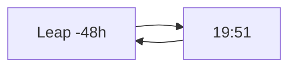

# Episode 13: Metaphysics Necrosis

__NOTOC__

Two days, on repeat. Okabe spends the episode inside a 48-hour loop trying
to out-position fate with a phone, a bicycle, and a rapidly fraying mind —
and the [[divergence-meter|Divergence Meter]] is born from the wreckage.

:::::columns{ratio="65-35"}
::::column

## Synopsis

Leap one: Okabe warns nobody, moves [[mayuri|Mayuri]] across town early.
She dies at 19:51 — a traffic accident, streets away from any Rounder.

Leap two: he tells [[kurisu|Kurisu]] everything. They hide Mayuri in
[[akihabara|Akihabara]]'s crowds. 19:51 — a platform surge at the station.
The pocket watch stops first, every time, like a courtesy.[^1]

Leap three, four, five: the episode compresses further attempts into a
montage that the fandom calls the ==necrosis reel==, each loop shot with
one fewer color until the frame is nearly gray. However the day is
arranged, the [[alpha-worldline|Alpha field]] converges. Kurisu — briefed
fresh each loop, believing him faster each time from the detail he
carries — says the quiet part: *the worldline has to change, not the day*.

Between leaps, [[daru|Daru]] and a hollowed-out Okabe begin assembling the
one instrument that could prove it: a meter that reads the divergence
number directly. [[suzuha-amane|Suzuha]] supplies the design — she has
seen one before, she says, in 2036, built by a man she never met.

:::note
The meter's first assembled prototype displays $0.337187$ — on-screen
confirmation of every reconstructed value this wiki's
[[alpha-worldline#Divergence readings|Alpha readings table]] lists for the
arc so far.
:::

::::

::::column

:::infobox{title="Metaphysics Necrosis" image="https://picsum.photos/seed/sg-ep13/300/180" caption="Loop four. The frame is running out of color."}
| | |
|---|---|
| Episode | 13 |
| Japanese title | 形而下のネクローシス |
| Air date | 2010-06-29 |
| Arc | [[episode-guide#The raid arc\|Raid arc]] |
| Worldline | [[alpha-worldline\|Alpha]] $0.337187$ |
| Leaps shown | 5 |
| Mayuri's deaths | 5 |
| Built | [[divergence-meter\|Divergence Meter]] |
| Focus | [[okabe\|Okabe]] |
| Previous | [[episode-12\|Dogma in Ergosphere]] |
| Next | [[episode-14\|Physically Necrosis]] |
:::

::::

:::::

::section[The loops]{icon="🔁"}

| Leap | Strategy | Outcome at 19:51 | Divergence |
|---|---|---|---|
| 1 | Relocate early | Traffic accident | 0.337187 |
| 2 | Full disclosure to Kurisu | Station crowd surge | 0.337187 |
| 3 | Confront Moeka preemptively | Rounder response | 0.337187 |
| 4 | Leave the city by train | Derailment delay; 19:51 | 0.337187 |
| 5 | Do everything at once | 19:51 | 0.337187 |

:::warning
Note the rightmost column: five radically different days, one unchanged
worldline. The leap moves memory, not the line — exactly the limit Kurisu
listed in [[episode-11#The time leap lecture|her lecture]]. Escaping
convergence requires raising $d$ past the anchor's tolerance, and the only
lever that moves $d$ is undoing D-Mails.
:::

::section[The meter]{icon="🔢"}

Eight nixie tubes and a sensor no one fully understands — Suzuha's design,
Daru's soldering, [[mr-braun|Mr. Braun]]'s donated tubes.[^2] The
[[divergence-meter|Divergence Meter]] converts the arc's invisible
arithmetic into a readable number, and its first reading is a sentence:
$0.337187$, the floor of the field, the number at which Mayuri dies.

The escape threshold, per Suzuha's 2036 intelligence: $d \ge 1.000000$ —
the [[beta-worldline|Beta attractor field]]. No D-Mail the lab has sent
moved the line more than $0.07$. They sent six.

::section[Continuity]{icon="🔗"}

- The undo arc is now fully specified: reverse the D-Mails of
  [[episode-10]], [[episode-09]], [[episode-08]] — in reverse order, each
  one a person's wish taken back.
- The meter's 2036 original and its unnamed builder are resolved in
  [[episode-22|the finale]].
- Loop 3 gives Moeka her first post-raid characterization; her arc
  continues in [[episode-14]].

:::collapse{title="Spoilers — the necrosis titles"}
Episodes 13–16 all carry "Necrosis" titles: the death is Okabe's Alpha-arc
self. The man who leaps out of episode 16 is not the man who leapt into
episode 13, and the show means the word clinically — tissue that will not
grow back.
:::

[^1]: Five loops, five stopped watches. The prop department built a
      rig so the second hand halts on camera without a cut.
[^2]: Braun asks no questions. On rewatch — knowing what [[episode-14]]
      reveals about his shop — this is the loudest scene he has.

#lore #episode

::navbox{title="Episodes" of="Episodes"}

[[Category:Episodes]]
