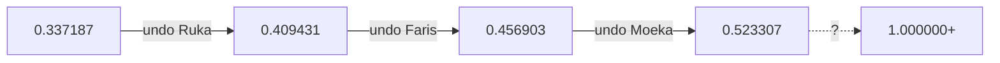

# Episode 14: Physically Necrosis

The undo arc begins. To climb out of the Alpha field's floor, Okabe must
take back the wishes his lab granted — starting with the one whose
beneficiary lost nothing and gained a life: [[ruka-urushibara|Ruka]].

:::::columns{ratio="65-35"}
::::column

## Synopsis

Armed with the [[divergence-meter|Divergence Meter]] and Suzuha's
threshold ($d \ge 1.000000$, the [[beta-worldline|Beta field]]), Okabe
maps the road out: undo the D-Mails in reverse. Last sent, first
unsent — [[episode-10|Ruka's]], then [[episode-09|Faris's]], then
[[episode-08|Moeka's]], the one that took the IBN 5100 and armed SERN.

The mechanics are ugly. A D-Mail cannot be *recalled*; it must be
**countermanded** — a second message that convinces the past to act as if
the first never arrived. And the sender's consent matters: these are
people's wishes, not Okabe's to revoke by stealth.[^1]

So Okabe asks. The episode's long, quiet center is Okabe explaining to
Ruka — who remembers no other life — that a version of the world exists
where Ruka was born a boy, that Mayuri dies on every line of *this*
world, and that he has no right to ask what he is asking. Ruka listens.
Ruka asks one question: **"In that world — was I still your apprentice?"**

The answer is yes. The consent is given before the sentence ends.

:::danger
The countermand goes out at 19:40. The lurch comes. The meter, in the
episode's final shot, reads $0.409431$ — one rung up the ladder, thirteen
episodes of consequences to climb back through.
:::

::::

::::column

:::infobox{title="Physically Necrosis" image="https://picsum.photos/seed/sg-ep14/300/180" caption="One rung up: 0.409431."}
| | |
|---|---|
| Episode | 14 |
| Japanese title | 形而上のネクローシス |
| Air date | 2010-07-06 |
| Arc | [[episode-guide#The undo arc\|Undo arc]] |
| Worldline | [[alpha-worldline\|Alpha]] $0.337187$ |
| Shift to | [[alpha-worldline\|Alpha]] $0.409431$ |
| Countermanded | Ruka's D-Mail ([[episode-10\|ep. 10]]) |
| Consent given by | [[ruka-urushibara\|Ruka]] |
| Meter reading | 0.409431 |
| Previous | [[episode-13\|Metaphysics Necrosis]] |
| Next | [[episode-guide\|Episode guide]] |
:::

::::

:::::

::section[The ladder]{icon="🪜"}

| Step | Countermand | Restores | Costs |
|---|---|---|---|
| 1 | Ruka's mail | This episode's climb | A life story |
| 2 | Faris's mail | Otaku [[akihabara\|Akihabara]] | Her father, again |
| 3 | Moeka's mail | The IBN 5100 trail | *See spoiler fold* |
| 4 | The first D-Mail | [[episode-01\|Ep. 01]]'s message | Everything else |

:::warning
Step 4 is the arc's buried lede: the ladder's top rung is Okabe's own
accidental D-Mail from [[episode-01]] — and undoing a message that reads
"Makise Kurisu has been stabbed" means restoring the timeline where the
stabbing *matters*. The meter can reach $1.000000$; the price is posted at
[[beta-worldline|the Beta worldline article]].
:::

::section[Consent as mechanic]{icon="🤝"}

The episode formalizes the undo arc's moral engine. Compare the trilogy
and its mirror:

| Wish granted | Wish revoked | Symmetry |
|---|---|---|
| [[episode-10\|Ep. 10]] — Ruka, silently happy | Ep. 14 — Ruka, knowingly grieving | Same shrine steps, same framing |
| [[episode-09\|Ep. 09]] — Faris's private text | Undone with her hand on the send key | Her choice, both times |
| [[episode-08\|Ep. 08]] — Moeka's hidden order | The arc's hardest ask | *Fold below* |

:::collapse{title="Spoilers — Moeka's countermand"}
Moeka's mail cannot be countermanded by persuasion — she is a Rounder and
the mail was her mission. The arc routes through her handler "FB," whose
identity is the mid-season's last twist: the shop below the lab was never
just a shop. [[mr-braun|Mr. Braun]]'s tubes were in the
[[divergence-meter|meter]] all along.
:::

::section[Analysis]{icon="🔬"}

:::figure{align="right" width="260"}

:::

"Physically Necrosis" completes the season's thesis statement: time travel
in this story is not a physics problem but a consent problem. Every rung
of the ladder is a conversation, and the meter's rising digits — $0.337$,
$0.409$, onward toward $1.048596$ and the
[[steins-gate-worldline|Steins Gate worldline]] — measure not energy but
forgiveness granted.[^2]

::section[Continuity]{icon="🔗"}

- The reverse-order rule is Suzuha's contribution, from watching SERN
  unwind resistance operations in 2036.
- Ruka's apprentice question echoes the pose scene from [[episode-05]].
- The meter's digits appear in the OP from this episode onward — the
  production's own spoiler, hidden at 24 frames per second.

[^1]: Kurisu's rule, stated over Okabe's objection and adopted into lab
      law: "You don't get to edit people back for your own convenience."
[^2]: The staff commentary on the home release uses almost this exact
      phrase, which the wiki notes with some smugness.

#lore #episode

::navbox{title="Episodes" of="Episodes"}

[[Category:Episodes]]
