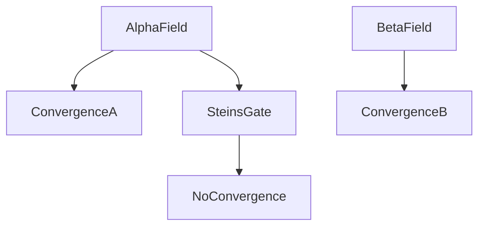

# Attractor Field Theory

:::infobox{title="Attractor Field Theory" image="https://picsum.photos/seed/attractor/300/180" caption="All rivers in a valley reach the same sea."}
| | |
|---|---|
| Type | Theoretical framework |
| Domain | Worldline dynamics |
| Key claim | Worldlines cluster into fields converging on fixed events |
| Named fields | [[alpha-worldline\|Alpha]], [[beta-worldline\|Beta]], others conjectured |
| Boundary indicator | Integer part of divergence value |
| Escape mechanism | Divergence beyond field boundary |
| Anomalous region | [[steins-gate-worldline\|Steins Gate]] (≈1.048596) |
| Instrument | [[divergence-meter\|Divergence Meter]] |
| Status within lab | Working model; predictive record strong |
:::

**Attractor Field Theory** is the [[future-gadget-lab|lab]]'s working
model of how worldlines behave under interference. Its core claim: history
is not one thread but a bundle, and the bundle is *combed*. Individual
worldlines within a field may differ in any amount of detail — who won a
bar quiz, whether a computer was donated to a shrine — but all of them
bend toward the same **convergence events**, which occur in every
worldline of the field regardless of intervention. Change the path all you
like; the destination holds.

The theory is why the lab's early optimism about D-Mails curdled. Undoing
a *cause* does not undo a *converged effect* — the field simply reroutes,
and the rerouting is not gentle. #lore

::section[Structure of a field]{icon="🕸️"}

::::columns{ratio="60-40"}
:::column
Worldlines are indexed by **divergence**, the number the
[[divergence-meter|Divergence Meter]] displays. The integer part names
the field: readings in `0.x` belong to the Alpha field, `1.x` to Beta.
Within a field, the fractional digits measure how far a worldline sits
from the field's central "channel" — but ==distance within a field buys
detail, not destiny==. An Alpha worldline at 0.33 and one at 0.57 disagree
about months of events and agree perfectly about the ones that matter.

Crossing *between* fields requires pushing divergence across the integer
boundary — an intervention so structurally large that the entire causal
chain feeding a convergence event fails at once. The lab has achieved this
exactly twice, in both directions, and neither method is recommended
reading before bed. See [[episode-13|Episode 13]] and
[[episode-16|Episode 16]].
:::
:::column
**Known convergence events**

- Alpha: a death in the lab's first
  summer; SERN's future
  dominion — see
  [[alpha-worldline#convergence]]
- Beta: a different death;
  a war over time travel —
  see [[beta-worldline#convergence]]
- Steins Gate: ==none known==
:::
::::

::section[The river metaphor]{icon="🏞️"}

The lab's standard explanation, owed to the future visitor who delivered
the meter: a field is a valley, worldlines are rivers, convergence events
are the sea. Rain falling anywhere in the valley reaches the same sea; to
reach a *different* sea you must leave the valley, and valleys are
separated by watersheds — high, hostile, and narrow. The Steins Gate
worldline, in this metaphor, is a river that ==exits through a cave no map
shows== and empties somewhere no one has charted. The metaphor is
acknowledged to break down exactly here, which lab consensus holds is the
metaphor working as intended.

::section[Predictions and record]{icon="📈"}

| Prediction | Test | Result |
|---|---|---|
| Undo mail cannot restore exact prior reading | 3 undo mails | Confirmed — residuals of 10⁻⁶ every time |
| Convergence event recurs despite cause removal | 5 interventions | Confirmed, 5/5, at rising personal cost |
| Time leaps cannot change fields | 6 leaps | Confirmed — intra-field motion only |
| Field boundary requires causal-chain collapse | 2 crossings | Confirmed |
| Omega field exists above 3.0 | 1 anomalous reading | Unconfirmed #stub |

:::warning
The theory's confirmed predictions are all *negative* — it tells you what
cannot work. The lab treats any plan that "just needs the attractor field
to make an exception" as automatically failed. This is written on the
whiteboard in the ink that doesn't erase.
:::

::::tabs
:::tab{label="Strong reading"}
Convergence is ontological: the field enforces its events the way geometry
enforces triangle angles. Interventions don't *fight* the field; they were
always part of it. Favored by [[kurisu|Kurisu]] on odd-numbered days.
:::
:::tab{label="Weak reading"}
Convergence is statistical: enough causal mass accumulates around certain
events that removing any one cause leaves thousands. Escape isn't
forbidden, merely astronomically unlikely — which is why it took a
[[time-leap-machine|leap machine]], eleven attempts, and a deception
operation to manage it once. Favored by Kurisu on even-numbered days.
:::
:::tab{label="Okabe reading"}
"The field is the will of Steins Gate, and it can be *negotiated with*."
Not a theory by any formal standard; predictive record, embarrassingly,
also 5/5.
:::
::::

:::collapse{title="Relation to established physics"}
The theory freeloads on the [[wp:Many-worlds interpretation]] for its
plurality of histories and on dynamical-systems language
([[wp:Attractor]]) for its central image, while being rigorously faithful
to neither. Kurisu's notebook files it under "phenomenology that works,"
the drawer above "physics," with a cross-reference reading: *a model that
predicts eleven for eleven has earned the right to be wrong later.*
:::

::section[See also]{icon="🔗"}

Foundational reading order for new lab members, per the
[[lab-member-handbook|handbook]]: this page, then
[[d-mail|D-Mail]] (how shifts are caused), then
[[divergence-meter|Divergence Meter]] (how they're measured), then
[[reading-steiner|Reading Steiner]] (who remembers them). The unwritten
companion piece [[worldline-topology|Worldline topology]] remains the
wiki's most-wanted red link.

:::figure{align="right" width="250"}

:::

::navbox{title="Technology" of="Technology"}
