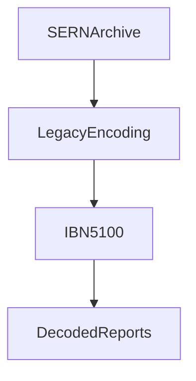

# IBN 5100

:::infobox{title="IBN 5100" image="https://picsum.photos/seed/ibn5100/300/180" caption="A 1975 portable computer worth more than the building it sits in."}
| | |
|---|---|
| Manufacturer | IBN Corporation |
| Released | 1975 |
| Class | Portable (luggable) personal computer |
| Mass | ~25 kg ("portable") |
| CPU | Custom 16-bit PALM-architecture processor |
| Display | 5-inch monochrome CRT, 64 × 16 characters |
| Storage | Quarter-inch cartridge tape, 204 KB |
| Languages | BASIC, APL |
| Hidden feature | Undocumented multibyte decoding routine |
| Significance | Only machine able to decode SERN's archived LHC reports |
| Known units in Akihabara | One (worldline-dependent) |
| Current owner | [[future-gadget-lab\|Future Gadget Laboratory]] (briefly) |
:::

The **IBN 5100** is a 1975 luggable computer of no particular distinction —
except for one undocumented capability that made a forty-year-old machine
the most contested object in [[akihabara|Akihabara]]: it is the only
computer that can read the archaic multibyte encoding SERN used for its
earliest internal reports. Anyone wanting to read what SERN's archives say
about time travel needs an IBN 5100 first. This includes, at various
points, SERN itself, a round-up of internet conspiracy theorists, and the
[[future-gadget-lab|Future Gadget Laboratory]].

::section[Why it matters]{icon="🗝️"}

::::columns{ratio="65-35"}
:::column
When [[daru|Daru]] first breached SERN's internal network, the juiciest
directories — decades of reports filed under a project name that translates
loosely to "Z Program" — turned out to be stored in a dead encoding no
modern toolchain could parse. Not encrypted: *encoded*, in a proprietary
interchange format IBN shipped briefly in the mid-1970s and documented
nowhere public.

The IBN 5100's firmware contains a translation routine for exactly this
format. IBN never advertised it; the routine appears to have been a
contractual deliverable for a single large customer, and the machine's
service manual refers to it only as "extended interchange support." Whether
that single large customer was SERN is the kind of question that gets a
wiki page flagged #lore, but the circumstantial case writes itself.
:::
:::column
**The chain of need**

Daru's hack → unreadable archives → need IBN 5100 → search
[[akihabara|Akiba]] → [[yanabayashi-shrine|shrine donation]] →
decode → regret. See [[episode-05|Episode 05]] onward.
:::
::::

::section[The Akihabara unit]{icon="🏮"}

Exactly one unit was known to survive in Akihabara, donated years ago to
the [[yanabayashi-shrine|Yanabayashi Shrine]] and kept in storage as an
offering nobody knew what to do with. The lab's acquisition of it — and the
worldline shifts that repeatedly *un*-acquired it — form one of the
stranger subplots of the lab's first summer. On some worldlines the machine
was never donated at all; on at least one it was destroyed in the 1990s. Its
presence or absence became an informal marker for which
[[alpha-worldline|Alpha worldline]] the lab was currently on, a job later
done properly by the [[divergence-meter|Divergence Meter]].

| Property | Value |
|---|---|
| Serial number | 5100-J-04471 |
| Condition | Working; CRT slightly burned |
| Shrine storage duration | ~10 years |
| Retrieval attempts | 3 (two undone by worldline shifts) |
| Final disposition | Worldline-dependent |

:::warning
If you have found what you believe to be an IBN 5100 at a flea market,
==do not post about it publicly==. This advice is offered without further
explanation. See [[episode-08|Episode 08]] for what happens to people who
don't take it.
:::

::section[Technical specifications]{icon="📐"}

::::tabs
:::tab{label="Hardware"}
A single-board design around IBN's PALM processor, executing an
interpreter in microcode: the machine runs BASIC and APL *natively* in the
sense that its "machine language" is itself emulated. This baroque design
is precisely why the decoding routine survives — it lives in the microcode
ROM, not on replaceable media.
:::
:::tab{label="I/O"}
Quarter-inch tape cartridges, a 5-inch internal CRT, and an external video
jack. Daru interfaced it to a modern network by wiring the video output to
a capture card and pointing OCR software at the result — a solution he
describes as "warcrime-adjacent, but shipping."
:::
:::tab{label="Emulation"}
The PALM microcode has never been fully dumped; emulators reproduce the
BASIC environment but not the interchange decoder. As of this writing the
physical machine remains irreplaceable.
:::
::::

:::collapse{title="Collector's market notes"}
Working 5100s trade hands for figures that would fund the lab for a year.
The [[radio-kaikan|Radio Kaikan]] retro-computing floor lists one perhaps
once a decade; the last public listing was withdrawn within four hours
under circumstances nobody at the shop will discuss. Rumors of a second
Akihabara unit surface annually and have never survived contact with a
camera.[^1]
:::

::section[See also]{icon="🔗"}

:::figure{align="left" width="240"}

:::

The real-world machine this article shamelessly resembles is documented at
[[wp:IBM 5100]]. Within this wiki, the IBN 5100's story is inseparable
from [[sern-lhc|SERN's LHC archives]], the shrine that sheltered it, and
[[okabe|Okabe]]'s repeated attempts to keep it in one worldline long
enough to finish a decode job. A planned page on the
[[palm-architecture|PALM architecture]] has not been written yet.

[^1]: The one photograph that allegedly exists shows, on close inspection,
    a beige sewing machine.

::navbox{title="Technology" of="Technology"}
