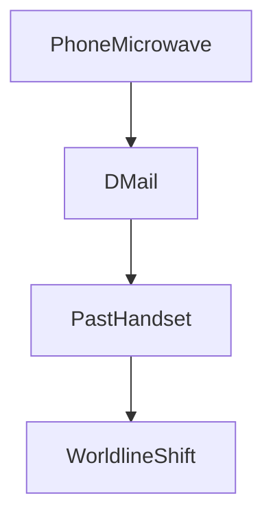

# Phone Microwave (Name; Phone Wave)

:::infobox{title="Phone Microwave (Name; Phone Wave)" image="https://picsum.photos/seed/phonewave/300/180" caption="Future Gadget #8 — do not use with metal in the drum."}
| | |
|---|---|
| Designation | Future Gadget #8 |
| Common name | Phone Microwave (Name; Phone Wave) |
| Function | Converts text messages into a transmittable data packet sent to the past |
| Inventors | [[okabe\|Rintaro Okabe]], [[kurisu\|Kurisu Makise]], [[daru\|Itaru Hashida]] |
| Housed at | [[future-gadget-lab\|Future Gadget Laboratory]] |
| Base unit | Modified consumer microwave oven |
| Payload medium | Bananas (early trials), text message metadata (later trials) |
| Effective range | Confirmed up to several decades; theoretical limit unknown |
| Known side effect | Localized worldline divergence |
| First success | Episode-linked to [[episode-01\|Episode 01]] |
| Current status | Decommissioned after Steins Gate worldline was reached |
| Danger class | #lore ==Restricted-use== |
:::

The **Phone Microwave**, universally shortened to **PhoneWave** by lab members
despite [[okabe|Okabe]]'s insistence on its full parenthetical name, is
[[future-gadget-lab|Future Gadget Laboratory]]'s eighth invention and the
device responsible for the entire plot of the lab's involvement with SERN.
It began as a failed attempt to fax organic matter and ended as the world's
first confirmed **D-Mail** transmitter — a machine capable of sending short
text messages into the past.

Its existence is the reason [[kurisu|Kurisu Makise]] first crossed paths with
the lab, the reason SERN dispatched surveillance and worse, and the reason
[[daru|Daru]] still refuses to eat bananas that have gone soft in a
microwave. See [[episode-guide]] for the episode-by-episode fallout.

::section[Development]{icon="🛠️"}

::::columns{ratio="65-35"}
:::column
The PhoneWave began life as an ordinary microwave oven purchased secondhand
for the lab's kitchenette. [[okabe|Okabe]] — convinced that "phone" and
"microwave" sounded like a suitably mad-scientist combination — rewired it
to accept a mobile handset docked in its drum, with the stated goal of
transmitting matter as a fax machine transmits paper. Early trials only
succeeded in liquefying bananas into a green paste the lab nicknamed
"Gel Banana," a #stub result that nonetheless proved *something* was
crossing between the microwave and the handset.

The breakthrough came after [[kurisu|Kurisu]] joined the lab and picked the
device apart. Her analysis reframed the gel bananas not as a failed
teleportation but as a **partial success**: the microwave wasn't moving
matter through space, it was scrambling a message through *time*. Once the
lab stopped trying to send solid objects and started sending SMS text
instead, the results became reproducible. Okabe rebranded the successful
configuration a "D-Mail," and the age of retroactive causality began.
:::
:::column
**Timeline of note**

- Gel Banana incident — first anomaly
- Kurisu's teardown — reclassifies device
- First successful D-Mail — text-only payload
- SERN surveillance begins shortly after
:::
::::

::section[Working principle]{icon="🔬"}

The PhoneWave does not "send" a message across time in any conventional
sense; it re-encodes a signal so that it destructively interferes with
itself along a closed timelike loop, arriving at the receiving handset
*before* it was sent from the transmitting one. The mechanism piggybacks on
microwave-band emissions and a commercial mobile phone's transceiver — which
is why an unmodified [[ibn-5100|IBN 5100]]-class capacitor bank was later
added to stabilize the packet once payloads grew longer than 148 characters.

The stored energy required for a single transmission is modest by
laboratory standards. Treating the discharge capacitor as an ideal
capacitor of capacitance $C$ charged to potential $V$, the energy budget is

$$E = \frac{1}{2}CV^2$$

which the lab measured at roughly 40 joules per successful D-Mail — enough,
Daru joked, "to toast half a bagel, or unmake a friendship."

::section[Modes of operation]{icon="⚙️"}

::::tabs
:::tab{label="Microwave mode"}
Functions as an unremarkable microwave oven. Used daily by lab members for
lunch, with the explicit house rule that nothing metallic goes in the drum
while the phone dock is active — a rule broken exactly once, memorably.
:::
:::tab{label="Phone mode"}
The docked handset receives a call routed through the internal modem. If the
call connects to a phone that existed in the past, the audio (later, SMS
text) reaching that older handset becomes a D-Mail. The sender hears
nothing; there is no dial tone, no ring — only silence and, later, a
notification on a phone that already existed.
:::
:::tab{label="Failure mode"}
Interrupting a transmission mid-cycle — by removing the handset or cutting
power — produces the Gel Banana effect on whatever is in the drum. The lab
keeps a running, unfunny tally.
:::
::::

:::warning
Every confirmed D-Mail shifted the observed [[divergence-meter|reading]] by
a measurable amount. The lab's early messages were sent with no
understanding of how small a change could cascade — see
[[alpha-worldline]] and [[beta-worldline]] for what happens when it does.
:::

::section[Sent D-Mails]{icon="📮"}

A partial, reconstructed log of transmissions lab members can corroborate.
Sortable by column.

| Date sent | Sender | Nominal recipient | Content summary | Divergence shift |
|---|---|---|---|---|
| — | [[okabe\|Okabe]] | Lab phone (past) | Bar quiz trivia rewrite | 0.000341 |
| — | [[kurisu\|Kurisu]] | Her own past phone | Correction to a public statement | 0.001220 |
| — | [[daru\|Daru]] | Convenience store phone | Lottery number test (aborted) | 0.000009 |
| — | Unknown | Lab landline | Warning message, contents disputed | 0.021557 |
| — | [[okabe\|Okabe]] | Lab landline | Rewinds a lab member's death | 0.081609 |
| — | [[okabe\|Okabe]] | Lab landline | Reverses the above rewind | 0.081609 |

:::collapse{title="Known temporal side effects (spoiler-adjacent)"}
Repeated use showed that memories of the "old" worldline can persist in some
individuals even after a shift — a phenomenon later formalized elsewhere as
a Reading Steiner-type effect. The lab does not fully understand why some
members retain memories and others don't; [[kurisu]]'s notes on the subject
remain incomplete. #lore
:::

::section[Media & related reading]{icon="🖼️"}

:::figure{align="right" width="260"}

:::

The device is permanently installed on the second floor of the
[[future-gadget-lab|lab]], bolted to the same workbench where
[[divergence-meter|the divergence meter]] sits. For a general treatment of
domestic microwave ovens (the mundane, non-time-traveling kind) see
[[wp:Microwave oven]].

:::gallery

:::

Related devices: [[time-leap-machine|Time Leap Machine]] (the PhoneWave's
successor once memory-only transmission became possible) and
[[d-mail|D-Mail]] for the messaging theory itself. Some lab visitors have
asked about a hypothetical voice-only variant; no such [[phonewave-mk2|Mark
II]] was ever built.[^1][^2]

[^1]: A whiteboard sketch exists. Whether it constitutes a "design" is
    disputed by everyone except Okabe.
[^2]: The name "PhoneWave" is retained here despite Okabe's repeated
    corrections because it is, empirically, what everyone calls it.

::navbox{title="Technology" of="Technology"}
